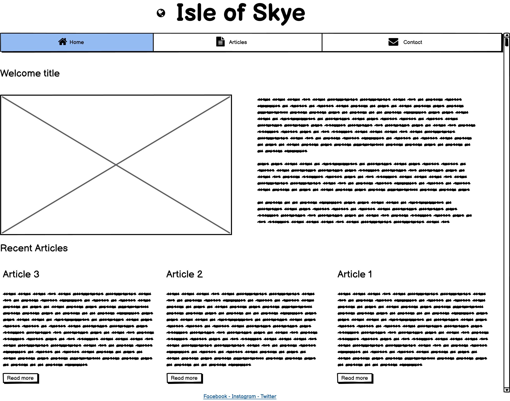
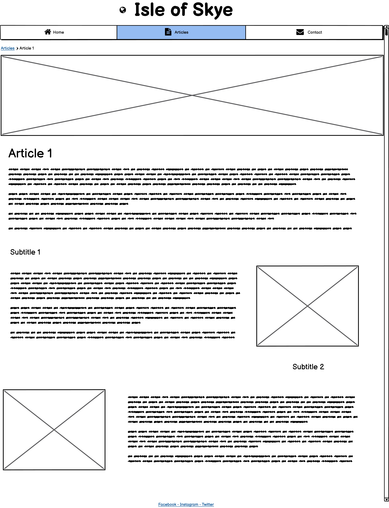
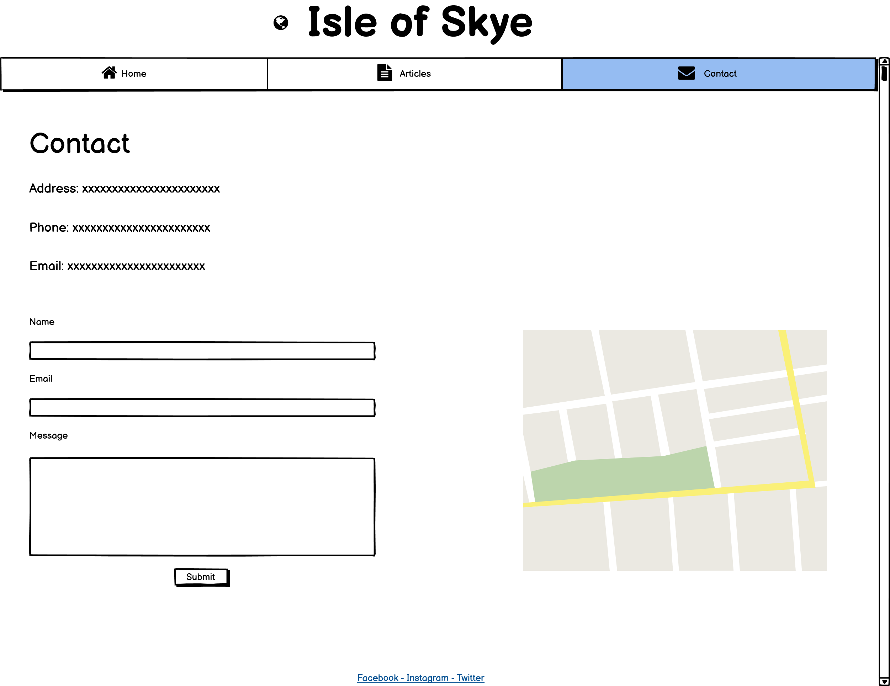
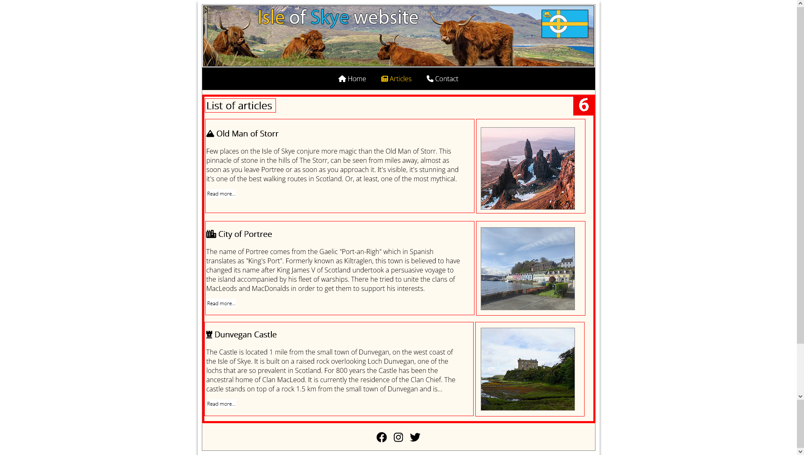
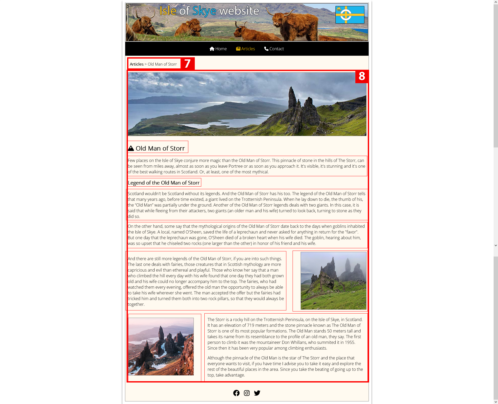

# Isle of Skye website
Welcome!
## Introduction
The Isle of Skye's website is a simple page whose sole mission is to offer information to visitors interested in tourism on the island. The web will be updated with new articles in which the visitor will be informed of the most important places on the island.

Live website can be found through this [link](https://ecabanasv.github.io/ci-project-one/index.html).

Ami link [here](https://ui.dev/amiresponsive?url=https://ecabanasv.github.io/ci-project-one/index.html)

## Table of Contents 

# Table of Contents
 [1. UX Design](#ux)
  - [User Goals:](#user-goals)
  - [User Expectations:](#user-expectations)
  -	[Colour scheme and font](#color-scheme)
  - [Website skeleton](#wireframes)
    - [Index](#index-page)
	- [Articles](#articles-page)
	- [Article](#article-page)
	- [Contact](#contact-page)
      
  [2. Features](#features)

  [3.Technologies](#technologies)

  [4.Testing](#testing-phase)

  [5.Bugs](#bugs)

  [6. Deployment](#deployment)

  [7. Acknowledgement](#acknowledgement)

  
# 1. UX design
  [Go to the top](#table-of-contents)
  
The Isle of Skye is the best known of the Highlands, the most appreciated and fascinating, also known as the Isle of Fairies for its impressive landscapes and hidden places. These remote lands of the North of Scotland, which have so inspired writers and painters, continue to arouse great admiration among travellers. The Isle of Skye was always separated from British soil until a bridge was built in 1995 linking the towns of Kyleakin and Kyle of Lochalsh.
  
Known simply as The Island, it has served as an inspiration for artists and travellers, a relief for sailors and a refuge for kings. But it is also home to fairies and giants, some of Scotland's best whiskey and cliffs that defy the north.

The following types of users can benefit from the use of this website:

* Students trips (Regular students, Language students etc)
* Regular travelers (Solo, Families, Hikers)
* Professionals (Archaeologists, Historians, Gaelic students/teachers)
 

## 1.1 User Goals
  [Go to the top](#table-of-contents)

The main objective of the website is to offer information to the visitor about the most interesting and most visited places on the Isle of Skye.

## 1.2 User Expectations
  [Go to the top](#table-of-contents)
  
The website offers the necessary information in a few articles about the best places to visit on the Isle of Skye. For travellers, professionals and students, the attractions offered by nature and the fantastic history of the Island are reflected in the main articles on the web. Among the main characteristics of the website, the user expects the content to be:

* Simple web structure and easy access. In a few clicks, you can cover all the content of the web.
* The user interface is intuitive and any type of user can use it without any advanced knowledge.
* Responsive web content for all types of devices (laptop, tablet and phone).
* Compatibility with the most used web browsers (Chrome, Firefox and Edge).
* Form of contact through various channels: Telephone, Email, Web form and social networks.

## 1.3 Color Scheme
  [Go to the top](#table-of-contents)

The colour scheme used on the web is not very complicated. The main colours of the Isle of Skye flag (bluish #01b4ee and yellowish #ffc801) were used for the menu items. For the HTML (background) and container (content) background colour are defined as follow:
* HTML: #white
* container: #floralwhite

## 1.4 Website Skeleton
  [Go to the top](#table-of-contents)
 
[Balsamiq](https://balsamiq.com/) it is the software that has been used to develop the wireframes of the web. It was very useful to start the idea of the project and with it, I was able to quickly generate the code of the web structure. Captures developed with the Balsamiq program are attached below.

### Index Page

	

### Articles Page

### Single Article Page

### Contact Page

### Mobile Version

  
# 2. Features
  [Go to the top](#table-of-contents)
 ### All 6 pages:

- Header images (1): Main header of the website that includes the title of the website, typical cows from Scotland and the Skye island flag
- Navigation bar (2): Nav bar of website thats includes the three menu elements of the site: Home, Articles and Contact. Colors (yellow from the Skye flag) changed when current page is different.
- Footer (5): The main footer is shared across the different pages and it contains the main social networks icons: FB, IG and Twitter.

### Index page:
- General elements shared with all pages (1, 2 and 5)
- Welcome main text (3): It contains the welcome title text, main text and image of Portree. In short it's described Isle of Skye.
- Recent articles title (4) and the last three articles of the site. In this case the articles are: Old Man of Storr, City of Portree and Dunvegan Castle which includes font awesome icon, short title and short intro.

The screenshot of index page is below:

  Index page UI:
  

### Articles page:
- General elements shared with all pages (1, 2 and 5)
- List of articles (6): Section that contains all the articles of the website. They are ordered from last (top) to first (bottom).
- Each article contains font awesome icon, title and medium intro.
- In the right sided of the article all the relevant articles images are shown.

The screenshot of articles page is below:

 Articles page UI:
  
  
### Article page:
- General elements shared with all pages (1, 2 and 5)
- Breadcrumb for single articles (7): It helps visitor to go back to articles from the single article.
- Single article content (8): All the relevant content of the article with main image, main text, subtext and images.

The screenshot of article page is below:

 Article page UI:
  

### Contact page:
- General elements shared with all pages (1, 2 and 5)
- Contact details (9): Includes address, phone and email of the site owner.
- Along with the details a contact form where visitor can send messages to owner (name, email and message required)
- And a map specifying the location of the site owner.

The screenshot of contact page is below:

  Contact page UI:
  

   
# 3. Technologies Used
  [Go to the top](#table-of-contents)

* [HTML5](https://en.wikipedia.org/wiki/HTML5) for structure and content of the website.
* [CSS3](https://en.wikipedia.org/wiki/CSS) used for style the content and structuring using CSS Grid system.
* [Balsamiq](https://balsamiq.com/) used for create wireframes in Desktop and Mobile versions.
* [Google Fonts](https://fonts.google.com/) used to import font-family "Open Sans".
* [Adobe Photoshop](https://www.adobe.com/uk/products/photoshop.html) used for image edition (header, resizing and optimizing size)
* [Font Awesome](https://fontawesome.com/) used for the icons on menu, articles and contact page.
* [Chrome](https://www.google.com/intl/en_uk/chrome/) used for debug and test the website.
* [Firefox Developer Edition](https://www.mozilla.org/es-ES/firefox/developer/) used for debug and test the website.
* [Github](https://github.com/) used to create and update the online repository of the project.
* [Gitpod](https://www.gitpod.io/) used for coding the project online.
* [W3C Markup](https://validator.w3.org/) and [Jigsaw validation](https://jigsaw.w3.org/) tools used for validate the HTML and CSS code of the project.
* [Ami](http://ami.responsivedesign.is/#) used for generate the different responsive versions of the project.

  
# 4. Testing
  [Go to the top](#table-of-contents)
  
## 4.1 Testing using tools

### 4.1.1 Browser Developer tools

The built-in tools of the Google Chrome and Firefox Developer Edition browsers have been used in the project. In this case, inspect each HTML and CSS element. These tools were also used to run different performance and optimization tests, such as Google Chrome's Lighthouse or the tools included to view the web on different device sizes.

### 4.1.2 Responsive Tools

An initial image has been included in the README made through the Ami web tool that includes the version in different web formats (Laptop, Tablet and Phone)

### 4.1.3 W3C Validator Tools (HTML and CSS)

Para la validación del código HTML se ha utilizado la herramienta oficial [W3C Markup](https://validator.w3.org/#validate_by_input+with_options).

- index.html

- articles.html

- article-1.html

- article-2.html

- article-3.html

- contact.html

- assets/css/style.css

## 4.2 Manual Testing

Web display has been tested on all available devices from the "Responsive Design Mode" tool of Firefox Developer Edition. This device list includes the following:

- Galaxy Note 20 (412x915)
- Galaxy S20 (360x800)
- Ipad (810x1080)
- Iphone 11 Pro (375x812)
- IPhone 12/13 Mini (390x844)
- IPhone 11 SE 2nd Gen (375x667)
- Kindle Fire HDX (800x1280)

 ## All 6 pages:
TEST            | RESULT                           | OK / FAIL  
--------------- | -------------------------------- | ---------------
Header| Correct visualization of header image / each page | OK
Navigation bar| Correct links and colors when select each menu / each page | OK
Footer| Correct size and links / each page | OK
Head title| Correct title / Each page | OK
Favicon| Correct visualization of favicon / Each page | OK
Responsive design| Correct visualization of content / each page | OK

 ### Footer

TEST            | RESULT                           | OK / FAIL  
--------------- | -------------------------------- | ---------------
Facebook | Open FB site in new tab | OK
Instagram| Open IG site in new tab  | OK
Twitter| Open Twitter site in new tab | OK

### Index page
TEST            | RESULT                           | OK / FAIL  
--------------- | -------------------------------- | ---------------
Main content| Correct content and style for main title, image and text | OK
Articles| Correct content and style for each articles: title and text | OK
Responsive content| Correct visualization of responsive design of content | OK

### Articles page
TEST            | RESULT                           | OK / FAIL  
--------------- | -------------------------------- | ---------------
Articles| Correct content and style for each articles: title and text | OK
Responsive content| Correct visualization of responsive design of articles content | OK

### Article page
TEST            | RESULT                           | OK / FAIL  
--------------- | -------------------------------- | ---------------
Single article| Correct content and style of single article: main image, sub images and sub text | OK
Responsive content| Correct visualization of responsive design of single article content | OK

### Contact page
TEST            | RESULT                           | OK / FAIL  
--------------- | -------------------------------- | ---------------
Contact details| Correct content and style of contact details: font awesome icons and text | OK
Contact form| Correct visualization of responsive design of contact form | OK
Contact form data | Check required fields name, email and message | OK
Contact map| Correct visualization of responsive design of contact map image | OK
Responsive content| Correct visualization of responsive design of contact page | OK

  
# 5. Bugs
  [Go to the top](#table-of-contents)

### Solved bugs
- 

  
# 6. Deployment
  [Go to the top](#table-of-contents)

  
# 7. Acknowledgement
  [Go to the top](#table-of-contents)
  
### Code
* 

### Content 
* 
  

